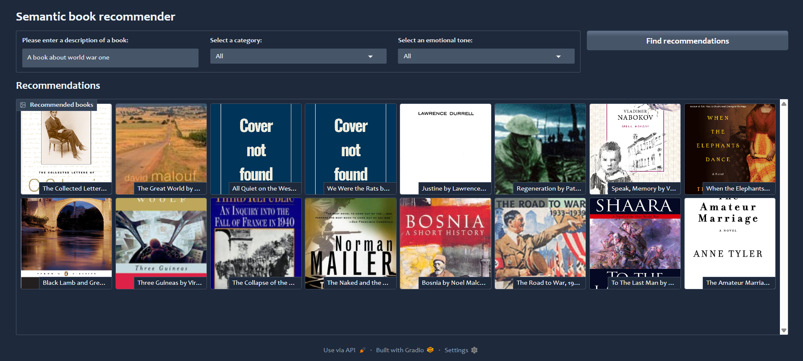
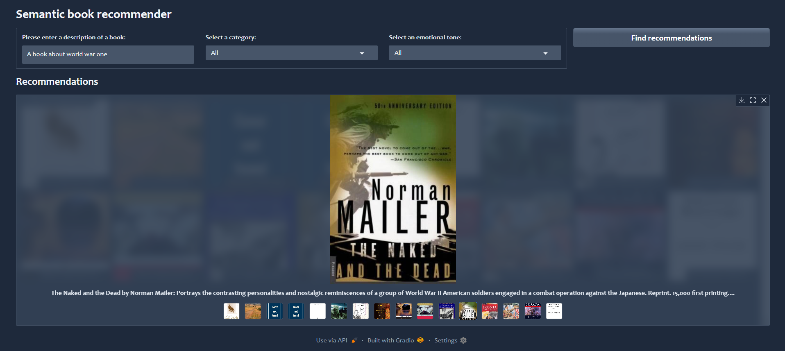
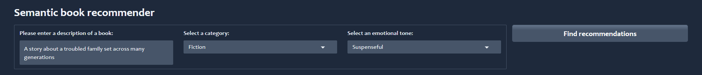
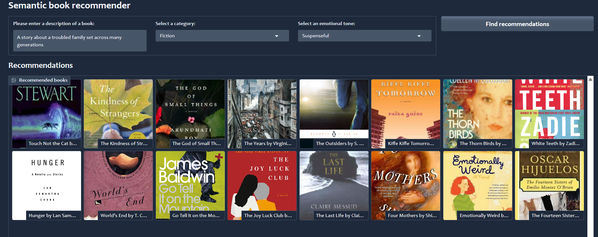
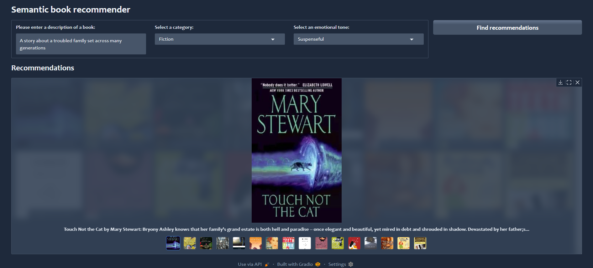

# 📚 LLM Book Recommender

A semantic book recommendation system created using **Large Language Models (LLMs)**, emotional tone analysis, and an interactive Gradio UI. 
This will recommend you books based on input, emotional preference, and category using vector similarity and sentiment analysis.

## API Used : [OpenAI](https://platform.openai.com/docs/api-reference/embeddings/create)
## Dataset : [7k Books](https://www.kaggle.com/datasets/dylanjcastillo/7k-books-with-metadata)

---

## 🔍 Features

- 🔎 **Semantic Search**: Uses vector similarity to find books based on a natural language query.
- 🎭 **Emotion-Based Filtering**: Choose books based on emotional tones like joy, sadness, fear, and surprise.
- 🧠 **LLM-Powered**: Utilizes `transformers` and `langchain` with OpenAI Embeddings for intelligent recommendation.
- 🖼️ **Visual UI with Gradio**: Simple and modern dashboard for book discovery.
- 📊 **Chroma Vector Database**: Fast similarity search using document embeddings.
- 📖 **Category Filtering**: Refine results by book genres.
- 🧾 **Pre-processed Emotions**: Book descriptions are analyzed and tagged with emotion scores using LLMs.

---

## ⚙️ Tech Stack

| Tool / Library     | Purpose                         |
|--------------------|---------------------------------|
| `Python`           | Core programming language       |
| `pandas` & `numpy` | Data handling & manipulation    |
| `transformers`     | Emotion classification model    |
| `langchain`        | Document management & retrieval |
| `OpenAIEmbeddings` | Embedding generation            |
| `Chroma`           | Vector similarity database      |
| `Gradio`           | Frontend UI                     |
| `dotenv`           | Secure environment config       |
| `requests`         | API requests                    |
| `json`             | Data serialization              |
| `PyCharm`          | IDE for development             |


---

## 🚀 How to Run

1. **Clone the repo**  
```bash
git clone https://github.com/your-username/llm-book-recommender.git
cd llm-book-recommender
```
2. **Install dependencies**  
```bash
pip install -r requirements.txt
```
3. **Set up environment variables**
```bash
# Create a .env file in the root directory
OPENAI_API_KEY=your_openai_key
```
4. **Run the app**  
```bash
python gradio-dashboard.py
```
5. **Open your browser**  
   Go to `http://localhost:7860` to access the Gradio UI.
6. **Input your preferences**  
   Enter a book description, select an emotional tone, and choose a category to get recommendations.
7. **Explore the results**  
   Browse through the recommended books and their details.
8. **Enjoy!**  
   Discover your next favorite book with our LLM-powered recommendation system.

---

## 🙌 Acknowledgements

- 🤗 [Hugging Face Transformers](https://huggingface.co/transformers/) – for powerful pre-trained language models.
- 🔗 [LangChain](https://www.langchain.com/) – for managing and chaining LLM-based workflows.
- 🧠 [OpenAI](https://openai.com/) – for embeddings and LLM APIs.
- 📦 [Chroma DB](https://www.trychroma.com/) – for fast and scalable vector similarity search.
- 🎨 [Gradio](https://gradio.app/) – for creating beautiful and interactive UIs easily.


---


## 🖼️ Screenshots











---